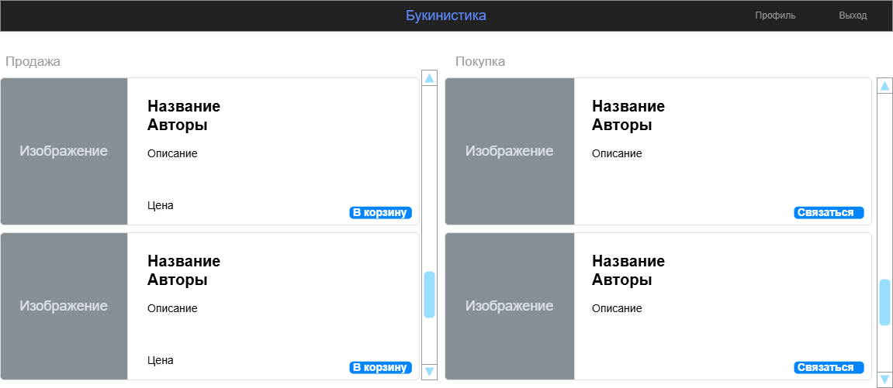

# Otuskotlin-homework

Домашнее задание по учебному проекту курса
[Kotlin Backend Developer](https://otus.ru/lessons/kotlin/).
Поток курса 2024-11

# Ads-second-hand-books

ads-second-hand-books - это площадка букинистики. Пользователи выставляют объявления
о продаже или поиске книг. Задача предоставить удобное место для размещения объявлений.

## Визуальная схема фронтенда

## Документация

1. Маркетинг и аналитика
   1. [Целевая аудитория](docs/01-biz/01-target-audience.md)
   2. [Заинтересанты](docs/01-biz/02-stakeholders.md)
   3. [Пользовательские истории](docs/01-biz/03-bizreq.md)
2. Аналитика
   1. [Функциональные требования](docs/02-analysis/01-functional-requiremens.md)
   2. [Нефункциональные требования](docs/02-analysis/02-nonfunctional-requirements.md)
3. DevOps
4. Архитектура
   1. [ADR](docs/04-architecture/01-adrs.md)
   2. [Описание API](docs/04-architecture/02-api.md)
   3. [Компонентная схема](docs/04-architecture/03-arch.md)
5. Тесты

# Структура проекта

## Подпроекты для домашних заданий по языку Kotlin

1. [m1l1-first](lessons/m1l1-first) - Вводное задание, создание первой программы на Kotlin
2. [m1l3-func](lessons/m1l3-func) - Работа с функциями
3. [m1l4-oop](lessons/m1l4-oop) - Работа с ООП
4. [m2l1-dsl](lessons/m2l1-dsl) - Работы с DSL
5. [m2l2-coroutines](lessons/m2l2-coroutines) - Работы с корутинами
6. [m2l3-flows](lessons/m2l3-flows) - Работа с Flows